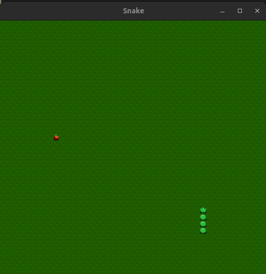

# Игра "Змейка"

## Особенности запуска

Игра компилируется с помощью `cmake`. Перед компиляцией удостоверьтесь что в системе присутствует библиотека `Qt 6`.

После компиляции, перед запуском исполняемого файла `snake`, удостоверьтесь что папка `img` с изображениями находится в папке с исполняемым файлом. Соответственно, если игра компилируется и запускается с помощью `VSCode`, то папка `img` должна быть в папке `build`. 

`CMakeLists.txt` содержит инструкции, которые создают папку `build/img` и копируют в нее изображения автоматически.

## Управление

Используйте `клавиши управления курсором` для изменения направления движения змейки.

После завершения игры нажмите `Пробел` чтобы начать игру заново.

Для выхода из игры нажмите `Esc`.